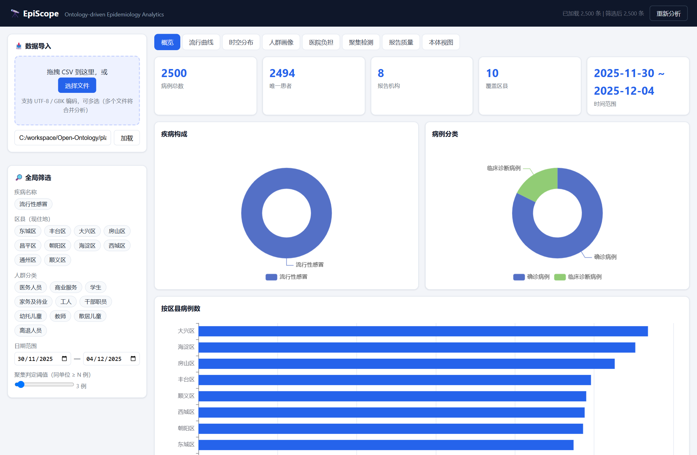
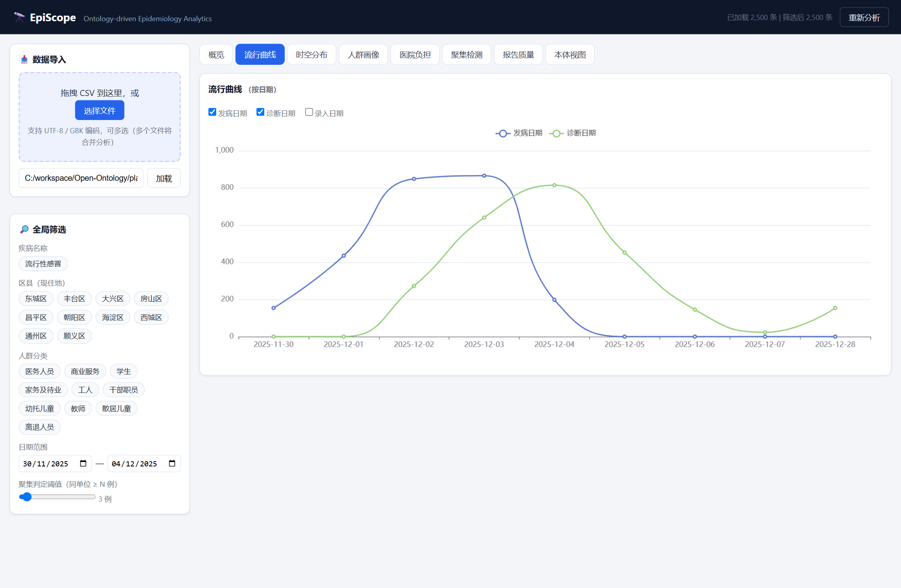
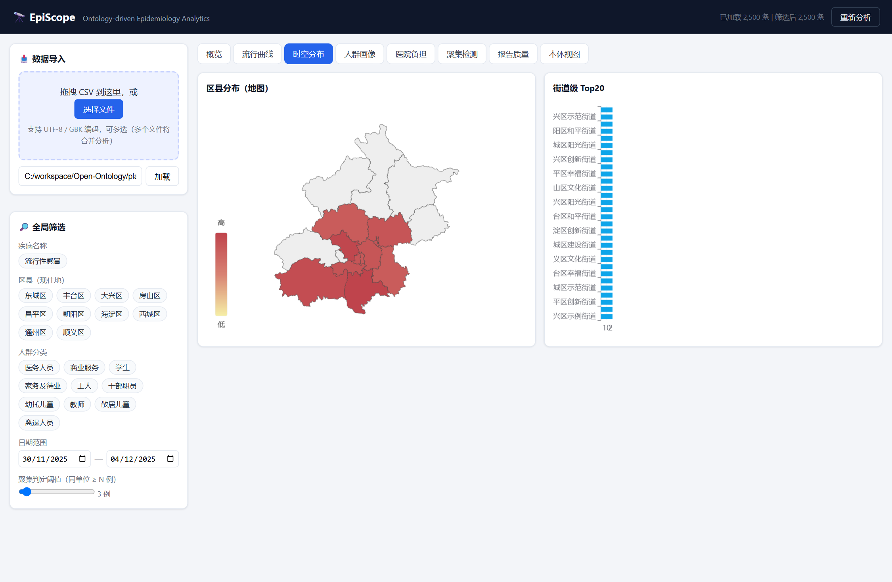
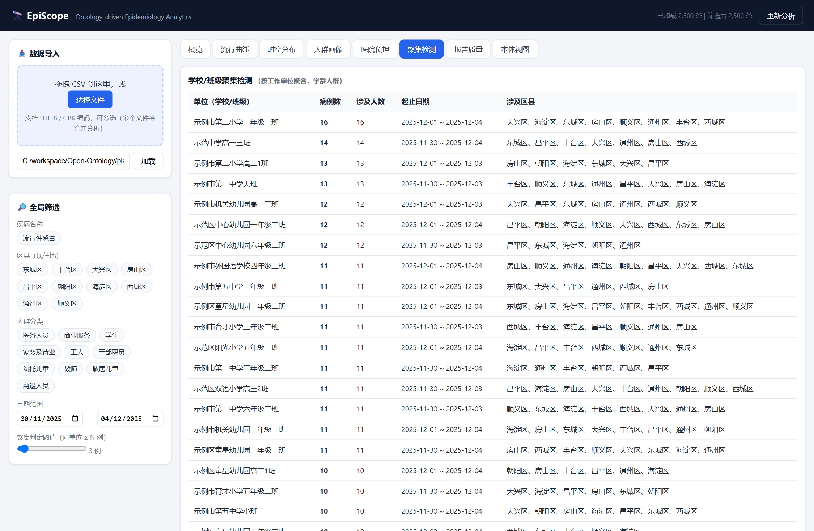
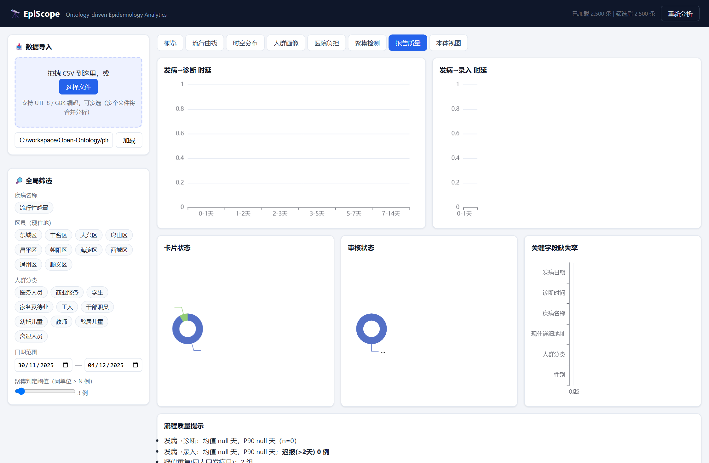
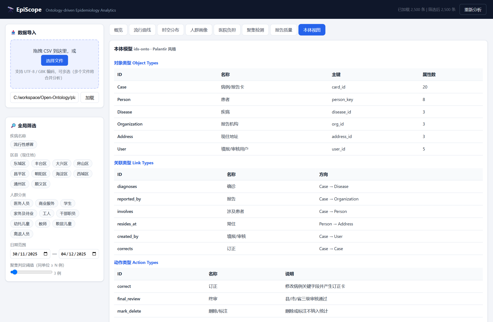
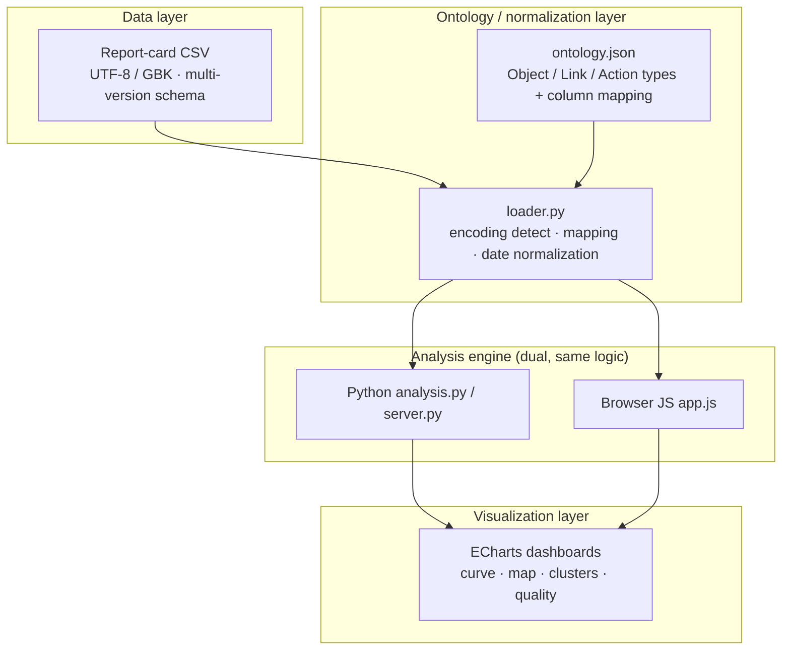

🌐 **[English](README.md)** | [简体中文](README.zh-CN.md)

# 🔭 EpiScope

**Ontology-driven epidemiological analysis platform** — an open-source, Palantir-Foundry-style toolkit for analyzing notifiable-disease report-card data (传染病报告卡 / 流调数据): ingest → ontology mapping → analysis → interactive visualization.

[](LICENSE)
[](https://www.python.org/)
[](https://fastapi.tiangolo.com/)
[](https://echarts.apache.org/)
[](https://github.com/feather100/episcope/pulls)

> ⚠️ **Privacy first**: the platform processes sensitive report-card data (names, phones, detailed addresses) **in-browser memory / transient server reads only** — never persisted, never exported. Analysis output contains **organization-level aggregates only** (no PII). Use the bundled **synthetic demo data** for demos; never commit real case data.

---

## ✨ Features

| View | What it does |
|---|---|
| 📊 Overview | KPIs (cases / unique patients / reporting orgs / districts / date range), disease & case-class composition |
| 📈 Epidemic curve | Onset / diagnosis / entry-date lines, toggleable |
| 🗺️ Spatiotemporal | Beijing district heat map + top street-level hotspots |
| 👥 Demographics | Crowd / sex / age-bucket profiles |
| 🏥 Hospital burden | Top reporting hospitals, org types, hospital × district flow |
| 🚨 Cluster detection | **School/class-level cluster detection** (semantic org-unit clustering, threshold-adjustable, no population denominator needed) |
| ✅ Report quality | Onset→diagnosis→entry latency, late-report alerts, correction chains, duplicate & missing-field stats |
| 🧬 Ontology view | Palantir-style object/link/action model + CSV→property mapping |

**Global filters** (disease / district / crowd / date range) apply to all views **instantly** — analysis runs locally in the browser; the Python engine is a same-logic twin for API/CLI use.

---

## 🚀 Quick start

```powershell
cd episcope
pip install -r requirements.txt
python -m uvicorn engine.server:app --host 127.0.0.1 --port 8000
```

Open **http://127.0.0.1:8000** → drag & drop a CSV (UTF-8 / GBK auto-detected) or load a local path.

### Try it with synthetic demo data

```powershell
python scripts/generate_demo_data.py 2500   # generates data/demo/demo_flu_cases.csv (GBK)
```

---

## 🖼️ Screenshots (synthetic demo data)

| | |
|---|---|
|  |  |
|  |  |
|  |  |

---

## 🏗️ Architecture (Foundry-style: data → ontology → analysis → visualization)



| Layer | Tech |
|---|---|
| Frontend | Vanilla JS + ECharts (vendored, offline-capable), GBK decode via `TextDecoder` |
| API | FastAPI (`/api/analyze`, `/api/raw_text`, `/api/ontology`) |
| Ontology | JSON schema — Object Types (Case / Person / Disease / Organization / Address / User), Link Types, Action Types, source mapping |
| Storage | In-memory (current) → Neo4j / TypeDB for multi-source graph use cases |

---

## 📁 Project structure

```
episcope/
├── app/                  # frontend (index.html / app.js / style.css / vendor)
├── engine/               # Python: loader.py · analysis.py · server.py (FastAPI)
├── ontology/
│   └── ontology.json     # Palantir-style ontology + CSV column mapping
├── scripts/
│   └── generate_demo_data.py   # synthetic (fictional) demo data generator
├── data/demo/            # generated synthetic demo CSV (GBK)
├── docs/screenshots/     # screenshots from synthetic demo data
├── requirements.txt
└── run.ps1
```

---

## 🔌 API

| Endpoint | Description |
|---|---|
| `GET /api/health` | health check |
| `GET /api/ontology` | ontology schema (JSON) |
| `POST /api/analyze` (multipart) | upload CSV(s) → full analysis JSON |
| `GET /api/analyze_local?path=…` | analyze a local file (dev / API use) |
| `GET /api/raw_text?path=…` | return decoded raw text (frontend local-path load) |

---

## 🛣️ Roadmap

- [ ] Multi-source graph extension (contacts / trajectories / lab data → Neo4j / TypeDB transmission networks)
- [ ] De-identified report export (Word / PDF)
- [ ] Role-based access & audit log (Palantir dynamic-layer equivalent)
- [ ] Historical-season comparison & trend prediction

---

## ⚖️ License

[MIT](LICENSE) © 2026 feather100

## 🙏 Disclaimer

For public-health research and demonstration. Not medical advice; not an approved surveillance system. Always comply with local personal-information-protection regulations when handling real data.
