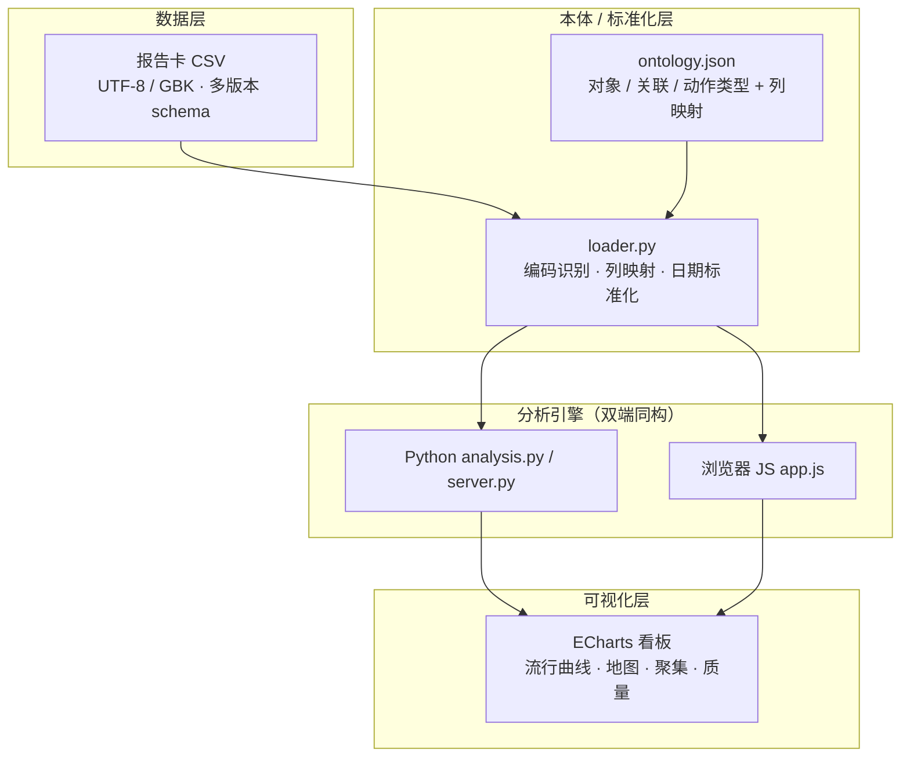

🌐 [English](README.md) | **[简体中文](README.zh-CN.md)**

# 🔭 EpiScope

**本体驱动的流行病学数据分析平台** —— 一个开源的、Palantir Foundry 风格的传染病报告卡 / 流调数据分析工具集：数据接入 → 本体映射 → 分析 → 交互式可视化。

[](LICENSE)
[](https://www.python.org/)
[](https://fastapi.tiangolo.com/)
[](https://echarts.apache.org/)
[](https://github.com/feather100/episcope/pulls)

> ⚠️ **隐私优先**：平台仅在浏览器内存 / 服务端瞬时读取中处理敏感报告卡数据（姓名、电话、详细地址）——**不持久化、不导出**。分析输出仅包含**机构级聚合信息**（不含个人身份信息）。演示请使用内置的**合成演示数据**；切勿提交真实病例数据。

---

## ✨ 功能特性

| 视图 | 说明 |
|---|---|
| 📊 概览 | 关键指标（病例数 / 唯一患者 / 报告机构 / 覆盖区县 / 时间范围）、疾病构成、病例分类 |
| 📈 流行曲线 | 发病 / 诊断 / 录入日期多线对比，可勾选 |
| 🗺️ 时空分布 | 北京市区县热力地图 + 街道级热点 Top30 |
| 👥 人群画像 | 人群分类、性别、年龄段分布 |
| 🏥 医院负担 | 报告单位 Top15、单位类型、医院 × 患者现住区流向 |
| 🚨 聚集检测 | **学校/班级级聚集检测**（组织机构语义聚类、阈值可调、无需人口分母） |
| ✅ 报告质量 | 发病→诊断→录入时延、迟报预警、订正链、重复卡与缺失字段统计 |
| 🧬 本体视图 | Palantir 风格对象 / 关联 / 动作模型 + CSV→属性映射 |

**全局筛选**（疾病 / 区县 / 人群 / 日期范围）对所有视图**即时生效** —— 分析在浏览器本地执行；Python 引擎为同构实现，供 API / CLI 使用。

---

## 🚀 快速开始

```powershell
cd episcope
pip install -r requirements.txt
python -m uvicorn engine.server:app --host 127.0.0.1 --port 8000
```

打开 **http://127.0.0.1:8000** → 拖拽 CSV（自动识别 UTF-8 / GBK 编码）或填写本地文件路径。

### 用合成演示数据体验

```powershell
python scripts/generate_demo_data.py 2500   # 生成 data/demo/demo_flu_cases.csv（GBK 编码，全部为虚构数据）
```

---

## 🖼️ 界面截图（合成演示数据）

| | |
|---|---|
|  |  |
|  |  |
|  |  |

---

## 🏗️ 架构（Foundry 风格：数据 → 本体 → 分析 → 可视化）



| 层 | 技术 |
|---|---|
| 前端 | 原生 JS + ECharts（本地化资源，可离线），GBK 解码 via `TextDecoder` |
| API | FastAPI（`/api/analyze`、`/api/raw_text`、`/api/ontology`） |
| 本体 | JSON schema —— 对象类型（Case / Person / Disease / Organization / Address / User）、关联类型、动作类型、源映射 |
| 存储 | 内存（当前）→ 多源图谱场景可升级 Neo4j / TypeDB |

---

## 📁 项目结构

```
episcope/
├── app/                  # 前端（index.html / app.js / style.css / vendor）
├── engine/               # Python：loader.py · analysis.py · server.py（FastAPI）
├── ontology/
│   └── ontology.json     # Palantir 风格本体 + CSV 列映射
├── scripts/
│   └── generate_demo_data.py   # 合成（虚构）演示数据生成器
├── data/demo/            # 生成的合成演示 CSV（GBK）
├── docs/screenshots/     # 合成演示数据截图
├── requirements.txt
└── run.ps1
```

---

## 🔌 API

| 接口 | 说明 |
|---|---|
| `GET /api/health` | 健康检查 |
| `GET /api/ontology` | 本体 schema（JSON） |
| `POST /api/analyze` (multipart) | 上传 CSV → 全量分析 JSON |
| `GET /api/analyze_local?path=…` | 按路径分析本地文件（开发 / API 用） |
| `GET /api/raw_text?path=…` | 返回解码后的原始文本（前端本地路径加载） |

---

## 🛣️ 路线图

- [ ] 多源图谱扩展（密接 / 轨迹 / 实验室数据 → Neo4j / TypeDB 传播网络）
- [ ] 脱敏报告导出（Word / PDF）
- [ ] 基于角色的权限与审计日志（对应 Palantir 动态层）
- [ ] 历史流感季对比与趋势预测

---

## ⚖️ 许可证

[MIT](LICENSE) © 2026 feather100

## 🙏 免责声明

仅供公共卫生研究与演示使用。不构成医疗建议，也非经批准的监测系统。处理真实数据时请遵守当地个人信息保护相关法规。
